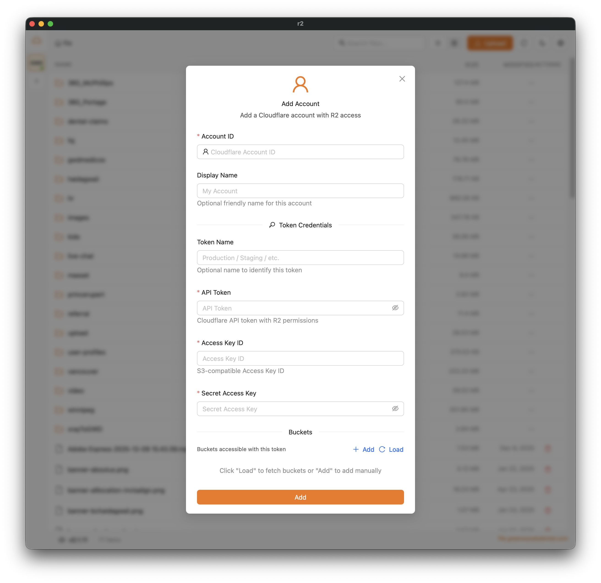

# Cloudflare R2 Client

A desktop application for managing S3-compatible storage (Cloudflare R2, AWS S3, MinIO, RustFS). Built with Tauri, Next.js, and React.

## Features

- **Multi-Provider Support** - R2, AWS S3, MinIO, and RustFS (path-style forced)
- **Multi-Account Support** - Manage multiple accounts across providers
- **Multiple Tokens per Account (R2)** - Each account can have multiple API tokens with different bucket access
- Browse and manage files in S3-compatible buckets
- Upload files and folders with resumable multipart uploads
- **File Preview** - Preview files directly in the app:
  - **Images**: jpg, jpeg, png, gif, webp, svg, bmp, ico
  - **Videos**: mp4, webm, ogg, mov, m4v
  - **PDFs**: Full PDF viewer with page navigation
  - **Text/Code**: Syntax-highlighted viewer with Monaco Editor supporting:
    - Code: js, ts, jsx, tsx, css, scss, less, html, vue, svelte
    - Config: json, yaml, yml, toml, xml, ini, env
    - Documents: txt, md, markdown, rst, log
    - Scripts: sh, bash, zsh, fish, ps1, bat, cmd
    - Data: csv, sql
- **Batch Operations** - Multi-select files and folders for:
  - **Batch Download** - Download multiple files with progress tracking, pause/resume support
  - **Batch Move** - Move files to different folders with folder tree picker
  - **Batch Delete** - Delete multiple files with confirmation and progress indicator
- Video thumbnail generation (via ffmpeg)
- Copy signed or public URLs to clipboard (provider-aware link building)
- Dark mode support
- Auto-updates

## Screenshots



### Required

- [Node.js](https://nodejs.org/) (v18+)
- [Bun](https://bun.sh/) - Package manager
- [Rust](https://www.rust-lang.org/tools/install) - For Tauri backend

### Optional (for video thumbnails)

- [ffmpeg](https://ffmpeg.org/) - Required for video thumbnail generation

```bash
# macOS
brew install ffmpeg

# Ubuntu/Debian
sudo apt install ffmpeg

# Windows (via Chocolatey)
choco install ffmpeg
```

## macOS Installation

On macOS, you need to manually allow the app to run:

1. Open **System Preferences** → **Privacy & Security**
2. Click **"Open Anyway"** next to the blocked app message

If the app doesn't appear in Privacy & Security settings, run:

```bash
sudo xattr -d com.apple.quarantine /Applications/r2.app/
```

## Development

```bash
# Install dependencies
bun install

# Run development server
bun run tauri dev
```

## Build

```bash
# Build for production
bun run tauri build
```

### Cross-compiling for Windows (from macOS/Linux)

To build Windows binaries from macOS or Linux, you need additional tools:

```bash
# Install required dependencies
# macOS
brew install cmake ninja llvm nsis

# Ubuntu/Debian
sudo apt-get install cmake ninja-build llvm nsis

# Install cargo-xwin
cargo install --locked cargo-xwin

# Setup Windows toolchain
cargo xwin setup

# Add Windows target
rustup target add x86_64-pc-windows-msvc

# Build for Windows
bun run tauri build --runner cargo-xwin --target x86_64-pc-windows-msvc
```

**Note:** Cross-compilation is experimental. For production builds, consider using GitHub Actions or a Windows VM.

## Configuration

### Adding an Account

1. On first launch, the "Add Account" dialog will open automatically
2. Choose the provider (R2, AWS, MinIO, RustFS) via the clickable tags
3. Enter provider-specific credentials:
   - **R2**:
     - **Account ID** (required) - Cloudflare account ID (from dashboard URL)
     - **Token Name** (optional)
     - **API Token** - R2 read/write token
     - **Access Key ID** / **Secret Access Key**
   - **AWS S3**:
     - **Access Key ID** / **Secret Access Key**
     - **Region** (required)
     - **Endpoint** (optional custom scheme + host)
     - **Force Path Style** (optional)
   - **MinIO**:
     - **Access Key ID** / **Secret Access Key**
     - **Endpoint** (scheme + host/port)
     - **Force Path Style** (optional)
   - **RustFS**:
     - **Access Key ID** / **Secret Access Key**
     - **Endpoint** (scheme + host/port)
     - **Force Path Style** is always enabled (not configurable)
4. Click "Load" to fetch available buckets, or manually add bucket names
5. Configure public domain per bucket (optional, R2/AWS only)

**Endpoint/Domain Tips**
- Endpoint and domain inputs accept full URLs (scheme + host) and normalize automatically.
- For R2/AWS public domains, you can select `http`/`https` explicitly.

### Managing Multiple Accounts

- **Sidebar** - Shows all configured accounts with token/bucket counts
- **Click account** - Opens drawer with all tokens and buckets for that account
- **Click bucket** - Switches to that bucket
- **Context menu** - Edit or delete accounts/tokens
- **Collapse sidebar** - Click the collapse icon to minimize to icon-only view

### Getting API Credentials

**Cloudflare R2**
1. Go to [Cloudflare Dashboard](https://dash.cloudflare.com/)
2. Navigate to **R2** → **Overview** → **Manage R2 API Tokens**
3. Create a token with appropriate permissions
4. Note the **Access Key ID** and **Secret Access Key** (shown only once)

**AWS S3**
- Create an IAM user with S3 permissions and generate access keys.
- Note the **Region** for your buckets.

**MinIO / RustFS**
- Use the access/secret keys from your deployment.
- Set the endpoint host/port and scheme (http/https).

## Data Storage

Account configurations are stored locally in a SQLite database:

- **macOS**: `~/Library/Application Support/r2/uploads-turso.db`
- **Windows**: `%APPDATA%\r2\uploads-turso.db`
- **Linux**: `~/.local/share/r2/uploads-turso.db`

## Tech Stack

- **Frontend**: Next.js, React, Ant Design, Zustand
- **Backend**: Tauri (Rust)
- **Storage**: Cloudflare R2, AWS S3, MinIO, RustFS (S3-compatible)
- **Database**: SQLite (via Turso - Rust-based SQLite-compatible database)
- **State**: TanStack Query, Zustand

## IDE Setup

- [VS Code](https://code.visualstudio.com/) + [Tauri](https://marketplace.visualstudio.com/items?itemName=tauri-apps.tauri-vscode) + [rust-analyzer](https://marketplace.visualstudio.com/items?itemName=rust-lang.rust-analyzer)
