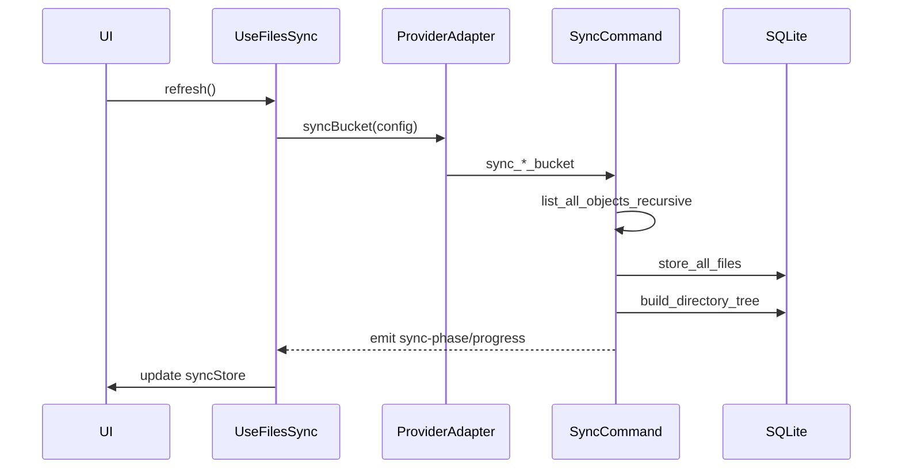
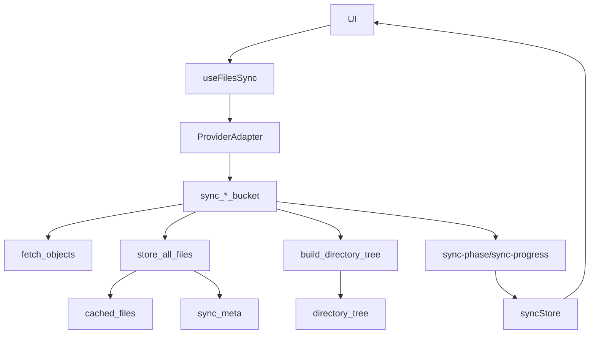

# Sync Structure

## Overview

The sync pipeline builds a local SQLite cache of bucket contents so the UI can browse quickly,
calculate folder sizes, and show per-folder aggregates. Sync is **per account + bucket** and
never mixes data across accounts.

## Frontend Flow (React)

- `useFilesSync` orchestrates sync lifecycle and listens for progress events.
- `syncBucket` in `src/app/lib/r2cache.ts` routes to the active provider adapter.
- `SyncOverlay` and `SyncProgress` render the phase and progress from `syncStore`.
- `useR2Files` loads folder listings from the local cache once sync is complete.

Relevant files:

- `src/app/hooks/useFilesSync.ts`
- `src/app/lib/r2cache.ts`
- `src/app/stores/syncStore.ts`
- `src/app/components/SyncOverlay.tsx`
- `src/app/components/status-bar-parts/SyncProgress.tsx`
- `src/app/hooks/useR2Files.ts`

## Backend Flow (Tauri)

Each provider exposes a `sync_*_bucket` command:

- `src-tauri/src/commands/r2_commands.rs`
- `src-tauri/src/commands/aws_commands.rs`
- `src-tauri/src/commands/minio_commands.rs`
- `src-tauri/src/commands/rustfs_commands.rs`

The command runs the same 3 phases:

1. **Fetching**: list all objects from the provider.
2. **Storing**: write files into SQLite (`cached_files`).
3. **Indexing**: build folder aggregates in `directory_tree`.

## Events and Phases

The backend emits progress events consumed by `useFilesSync`:

- `sync-phase`: `fetching` → `storing` → `indexing` → `complete`
- `sync-progress`: number of objects fetched so far
- `indexing-progress`: `{ current, total }` during tree build

## Data Model (SQLite)

Stored in `src-tauri/src/db/file_cache.rs`:

- `cached_files`: one row per object (bucket + account scoped)
- `directory_tree`: aggregated folder stats for quick listing
- `sync_meta`: last sync timestamp and file count

## Sequence Diagram

## Data Flow Diagram

## Notes on Cross-Account Transfers

Sync only caches a **single account + bucket**. For cross-account data movement,
use the Move workflow (Batch Move / Move Tasks), which has its own queue and progress UI.
